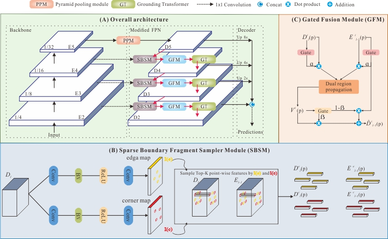

# SGFANet
Implementation of the paper: Learning Sparse Geometric Feature for Building Segmentation from Low-resolution Remote Sensing Images. 

The paper is under the revision of the IEEE TGRS.

This page is not the final version, after the revision, we will upload all the source code.

## Contents

- [Overview](#Overview)
- [Requirements](#Requirements)
- [Data](#Data)
- [PretrainedModels](#PretrainedModels)
- [Utilization](#Utilization)
- [Citation](#Citation)
- [Question](#Question)

## Overview
<div align="center">

<p> Frameworks of the proposed SGFANet. (A) The overall pipeline of the proposed SGFANet, which follows a FPN-like structure, including a bottom-up basic hierarchical feature extractor, a top-down FPN composited by SBSM, GFM and GT, and a light-weight decoder. (B) The sparse boundary fragment sampler module (SBSM), which serves for sampling Tok-K representative feature points about the building boundary (i.e., the edge and corner). K is a hyper-parameter and can be different for edges and corners. (C) The gated fusion module (GFM). It is utilized to calculate the affinity of the selected point-wise features.</p>
</div>

## Requirements

## Data

## PretrainedModels
Pretrained resnet-50 and resnet-101: Baidu Pan Link: https://pan.baidu.com/s/1aGd-9u65T14-hAPF0MCmGA   s4fs

Download them and make sure to put the pretrained models as the following structure

 ```
Your project
  ├── pretrained_models
  |   ├── resnet50-deep.pth
  │   ├── resnet101-deep.pth
  └── Nets
      ├── ......
  └── Loss
      ├── ......
  ......
  
  ```

## Utilization
See the main.py, we give some examples about how to train and test.
## Citation

## Question
